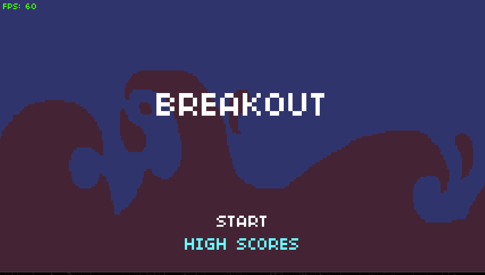
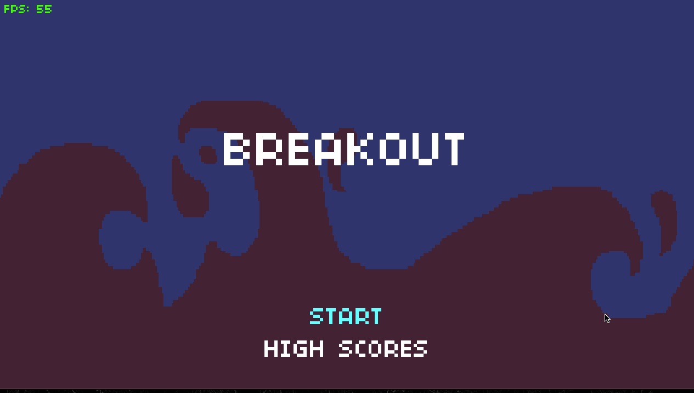
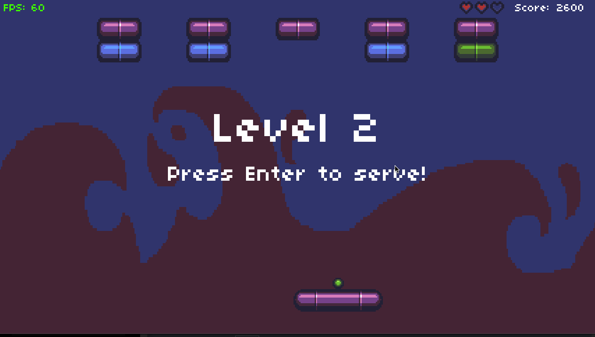

# edX CS50 Introduction to Game Development: Breakout

This is `Project 2` for [CS50's Introduction to Game Development](https://cs50.harvard.edu/games/2018/).

The game is a clone of the classic Atari game Breakout, where the player must use a paddle to bounce a ball upwards, towards a wall of bricks. The ball will bounce off the walls and the bricks, and if it hits the bottom of the screen, the player will lose a life. The player wins a level once all the bricks are destroyed.

The goal of this project is to take the provided [Love2D]() project and add several features to it:

- [ ] Double Ball Powerup
- [ ] Locked brick with Key Powerup to unlock
- [x] Dynamic paddle size based on score and losing a life

## Dynamic Paddle Size

The project description said to shrink the paddle when the user loses a heart and increase it as the score increases, but I intend to use the reverse logic in order to make it easier for players that are having trouble and harder for players who are already excelling.

However, in order to make the game a little more forgiving for less skilled players and a little more challenging for more skilled players, I implemented a dynamic paddle system that reverses the project description's logic:

**The paddle shrinks as the players score increases and grows each time the player loses a heart.**

Punishing a player for failing by making the game feel harder is a mechanic best suited for more hardcore games, like a Souls-like, and not quite appropriate for something like Breakout.

I believe that the mechanic that I implemented leads to a more fun and engaging experience for players across the spectrum of skill levels.

This was easy to implement by adding a `Paddle:setSize()` method that allows the developer to set the paddle's size to:

- `1`: `16px`
- `2`: `32px` (the default size)
- `3`: `64px`
- `4`: `128px`

And then calling that method when the player loses a heart or reaches a certain score threshold.

The growth and shrink events both trigger a new sound effect.

### Assistive Paddle Growth



The paddle will increment in size, up to size `4`, each time the player loses a heart.

### Reactive Paddle Shrinkage 


When the player reaches `3500` points since the last time they lost a heart - or the start of the game - the paddle will shrink one size, to a minimum of size `1` (which is `16px` wide).

This counter resets every time the player loses a heart and also increases by 25% each time the player encounters a paddle shrink, so a player with a paddle of size `3` will need to score `3500` points to reach the default of size `2` and then another `4375` points to reach the smallest size of `1`. If they lose a heart, the paddle size will grow and the counter will reset to `3500` points for a shrink event.

### Clamping Paddle Size

In order to make it easier to just set the size to the current size minus 1 or plus 1 without worrying about over/under flowing the `PADDLE_SIZE` table, I borrowed the [`clamp()` function from the Love2D Wiki](https://love2d.org/wiki/Clamping):

```lua
---
-- Clamps a value to a certain range.
-- @param min - The minimum value.
-- @param val - The value to clamp.
-- @param max - The maximum value.
--
function clamp(min, val, max)
    return math.max(min, math.min(val, max));
end
```

I'm used to a clamp where the value is the first parameter and the min and max follow, but this one from the Wiki uses `min`, `val`, and `max` which took some getting used to.

Learn more about [clamping](https://en.wikipedia.org/wiki/Clamping_(graphics)).

### Paddle Particle Effects



To give the paddle growth and shrinking effects a little more "oomph" and make them more visible, I duplicated the particle effect from the brick hit event to give the paddle a nice particle transition effect.

To make this appear as expected, the `Paddle:renderParticles()` method needs to be called in the `ServeState:render()` method, after the `self.paddle:render()` call to make sure the particles render on top of the paddle.

## Locked Bricks

Adding locked bricks in a way that feels fair was an interesting challenge. Ultimately I settled on a random system that increases in likelihood as the player progresses and also allows for more locked bricks as the player progresses.

## Issues with the Current Implementation



- "Floaty" ball physics: the initial serve can be very slow and make the game feel boring and unresponsive
- Naive collision detection: the collision detection algorithm does not seem to take into account things like the paddle direction (which should be able to influence the direction of the ball when it leaves the paddle) or properly handle corner hits - which sometimes make the ball suddenly pop out of the top of the paddle
- Inconsistent ball acceleration: the ball occasionally gets bursts of speed or slows down for no apparent reason which makes the game physics feel confusing

